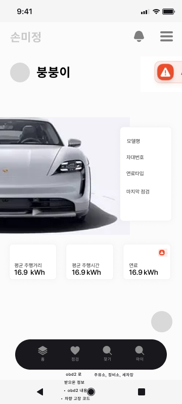
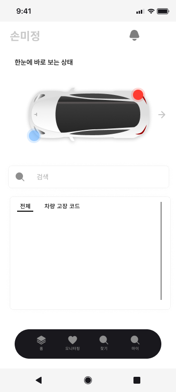
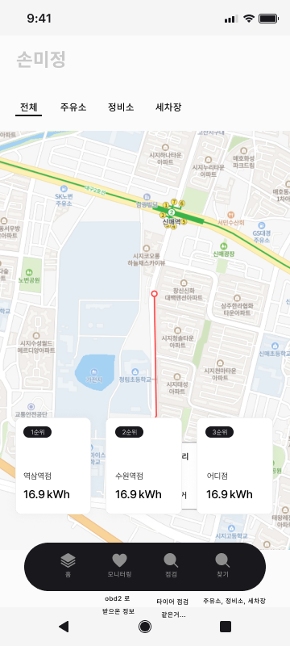
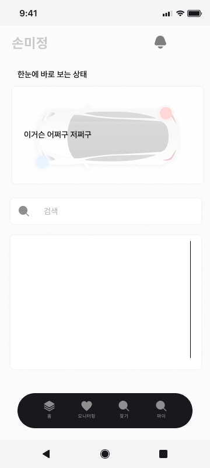

# 내 손안에 차량 미니 정비사! "손미정"

**AI 기반 차량 상태 정밀진단 서비스**

  
  

---

## ✨ 소개

**손미정**은 AI 기술과 실시간 차량 데이터 모니터링을 접목한 차량 진단 서비스입니다.  
사용자는 별도의 서비스센터 방문 없이도 언제 어디서나 자신의 차량 상태를 정밀하게 진단할 수 있으며,  
차량의 고장 여부, 소모품 교체 필요성, 최적의 연료 구매 시점 등 다양한 정보를 한눈에 확인할 수 있습니다.  
또한, 주행 기록 및 사고 이력을 기반으로 자동차 보험 관리까지 지원하여 비용 절감과 편리한 차량 관리를 실현합니다.

---

## 🔍 주요 기능

-   **AI 기반 차량 상태 정밀진단**  
    엔진오일 교체 여부, 배터리 상태 등 실시간으로 차량의 고장 여부와 상태를 진단합니다.

-   **구매 필요 예상 소모품 견적 제공**  
    차량 소모품 교체 시기를 미리 예측하고, 예상 견적을 자동으로 제공하여 불필요한 비용 발생을 방지합니다.

-   **최적의 연료 공급처 및 시점 안내**  
    연료 구매 시점과 공급처를 분석하여 최적의 옵션을 안내, 비용과 시간을 절감합니다.

-   **이미지 인식 AI 기반 타이어 교체 여부 알림**  
    MobileNet을 U-Net의 인코더(백본)로 활용하여 타이어 홈과 표면을 구분하고,  
    MobileNet 기반 모델을 사용해 타이어 홈 깊이를 정밀하게 추정, 교체 필요 여부를 판단합니다.

-   **주행 기록 및 사고 이력 기반 자동차 보험 관리**  
    차량의 주행 데이터와 사고 이력을 분석하여 보험 관련 혜택 및 비용 최적화를 지원합니다.

---

## 🎯 프로젝트의 특장점 (기능 관점)

-   **실시간 차량 모니터링**  
    서비스센터 방문 없이도 언제든지 내 손안에서 차량 상태를 수시로 확인할 수 있습니다.

-   **자동 견적서 제공**  
    별도의 검색 없이도 필요한 소모품 견적서를 자동으로 제공하여 사용자의 편의성을 높입니다.

-   **비용 절감**  
    차량 관리의 효율성을 극대화하여 유지비용 및 보험 비용 등 전반적인 비용을 절감합니다.

-   **전문 가이드 제공**  
    개인이 판단하기 어려운 부품 교체 등 중요한 의사결정에 대해 명확한 가이드를 제공합니다.

-   **보험 혜택 및 비용 최적화**  
    주행 기록과 사고 이력을 기반으로 한 보험 관리로 마일리지 혜택과 비용 최적화를 실현합니다.

---

## 🚀 프로젝트의 차별점 (기술 관점)

-   **실시간 데이터 모니터링**  
    CAN 통신(OBD II 프로토콜)을 활용해 차량 데이터를 실시간으로 수집, 모니터링합니다.

-   **고장 코드 분석**  
    OBD2 DCT (고장코드) 분석을 통해 차량의 상태를 신속하고 정확하게 진단합니다.

---

## 🤖 AI 기술 활용

-   **타이어 이미지 분석**  
    MobileNet을 U-Net의 인코더(백본)로 사용하여 타이어의 홈과 표면을 구분합니다.

-   **타이어 홈 깊이 추정**  
    MobileNet 기반 모델을 이용하여 타이어 홈의 깊이를 정밀하게 추정, 교체 시기를 예측합니다.

---

## 🛠️ 기술 스택

-   **Frontend:** Dart, Flutter
-   **Backend:** Spring Boot, Spring Data JPA, Spring Security
-   **DB:** MySQL, Redis
-   **Infra:** AWS EC2, Jenkins, Docker, Nginx, GitLab

---

## 👥 역할 분담

-   **Frontend:** 김지훈, 오승원, 이가영, 조현희
-   **Backend:** 윤수빈, 김두철, 이가영
-   **Infra** 김두철, 윤수빈

---

## 🗺️ 향후 기능 및 로드맵

-   **확장된 진단 기능**  
    보다 다양한 차량 부품 및 센서 데이터를 활용한 진단 기능 추가.

-   **예측 정비 및 예약 서비스**  
    AI 기반 예측 정비 알림과 연계하여 정비 예약 시스템 도입.

-   **사용자 맞춤형 알림 및 대시보드**  
    개인 차량 사용 패턴에 기반한 맞춤형 정비 알림 및 비용 분석 대시보드 제공.

-   **커넥티드 카 및 IoT 연동**  
    IoT 디바이스와의 연동을 통해 차량 외부 환경과 상태를 통합 모니터링.

-   **보험 연계 서비스 강화**  
    주행 기록과 사고 이력을 더욱 심도 있게 분석하여, 보험사와 협업한 맞춤형 보험 혜택 제공.

---

> 손미정은 차량 관리의 새로운 패러다임을 제시하며,
> AI와 최신 기술을 접목해 사용자가 언제 어디서나 차량 상태를 쉽고 편리하게 관리할 수 있도록 돕습니다.
