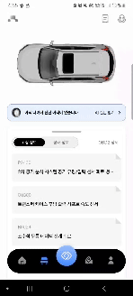
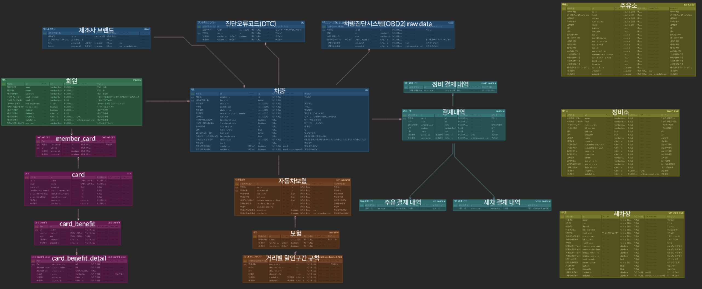

# 💖 마리모

> **프로젝트 기간:** 2025.03.03 ~ 2025.04.01 (총 6주)  

---

## 🎯 프로젝트 소개

**"차량 정비소에서 차량 점검을 위해 사용하는 OBD2 스캐너를 아세요?"**

최근 고속도로에서 화물차 바퀴가 빠져, 반대 차선의 버스를 덮쳐 사상자가 발생하는 사고가 있었습니다. 순식간에 일어났지만, 차량 정기 점검을 했더라면 예방할 수 있는 사고였습니다. 실제로, 차량 점검을 통해 예방할 수 있는 사고는 약 44000만 건(도로교통공단, 2023)이였습니다. 전체 사고 횟수인 194,283회(경찰청, 2023) 중 약 22% 정도나 되는 것입니다.

실제 정비소에서는 OBD2 스캐너를 이용해 차량 점검을 진행합니다. 해당 모듈과 블루투스 연결을 해서 다양한 코드 값을 받아오는 것이죠. 저희 마리모는 OBD2 모듈을 이용해서 데이터를 받아온다면, 앱을 만들어 운전자도 스스로 차량 점검을 할 수 있도록 도울 수 있지 않을까? 라는 생각에서 탄생했습니다.

OBD2 스캐너를 이용해 받아온 고장 코드를 AI를 통해 분석해주고, 마리모 만의 알고리즘을 통해 차량 상태를 분석해줍니다. OBD2 스캐너를 통해 받지 못하는 타이어 정보는, 자체 제작 AI 모델을 통해 타이어 마모도를 확인하고 타이어 교체 시기를 알려줍니다.

**"차량을 움직이게 하는 건, 결국 돈이다"**

차량을 움직이게 하는 건 뭘까요? 기름? 엔진? 바퀴? 아닙니다. 저희는 결국 '돈'이라고 생각했습니다. 차를 운전하기 위해 주유를 해야하고, 고장나면 고쳐야 하고, 보험도 가입해야하고... 결국 돈으로 차를 움직이는 것이죠.

그래서 저희는 카드 혜택과 거리, 가격 기반으로 주유소를 추천해주고, 가까운 정비소를 알려줍니다. 운전자라면 모두 갖고 있는 마일리지 특약 할인율을 보여주고 제출 시기를 최적화해줍니다. 또한 차량 관련 결제 내역도 관리할 수 있는 차계부까지 지원합니다.

저희 마리모를 통해 차량을 손쉽게, 한눈에, 빠르게 관리하세요!

---

## ✅ 핵심 목표

- **OBD2 모듈과 블루투스 통신을 통해 차량 데이터 분석 및 AI, 알고리즘을 활용한 결과 제공**
- **자체 구축 AI를 통해 타이어 마모도 분석**
- **내 카드 및 거리 기반 최적 주유소 추천 후, 카카오 네비 활용 길 찾기**
- **On-Device AI를 활용해 차계부 음성 입력, 차량 관련 정보 제공**
- **마일리지 특약 최적화 기능**

---

## ✨ 주요 기능

### 고장 코드 분석
- OBD2 데이터를 통해 차량의 고장 코드를 받아오고 확인합니다.
- 고장 코드가 발생하면, 홈 화면에서 알림을 통해 한 눈에 확인할 수 있습니다.
- 자세한 내용은, AI를 활용해 원인과 해결 방안에 대한 분석 정보를 제공합니다.

### 차량 상태 분석
- OBD2로 수집한 상태 정보를 바탕으로 자체 알고리즘이 차량의 전반적인 상태를 분석하고, 사용자에게 직관적인 분석 결과를 제공합니다.

### OBD2 상세 정보 조회
- RPM, 속도, 엔진 부하 등 실시간으로 변하는 데이터를 한 눈에 확인할 수 있습니다.

### 타이어 마모도 점검
- 직접 제작한 AI 모델을 활용하여 타이어의 마모 상태를 점검하고, 교체 시점을 알려줍니다.

### 주유소 추천
- 내가 가지고 있는 카드를 불러오고, 혜택을 적용할 주유 카드를 등록할 수 있습니다.
- 등록한 카드의 전월실적을 확인한 뒤 혜택과 현재 위치, 주유소 가격 정보를 종합해 사용자에게 가장 유리한 주유소를 추천합니다.

### 마일리지 특약 보험 정보 제공
- 현재 할인율, 다음 할인율, 현재 구간 정보, 다음 구간까지 남은 거리, 현재 구간 환급 예상액, 예상 총 주행거리 (만기일 기준), 보험료 관리 팁을 제공합니다.
- 마일리지 특약을 제출해야 하는 달이 되면, 특약 제출 일자를 최적화하여 알려줍니다.

### 차계부
- 차량 관련 지출 내역을 손쉽게 관리할 수 있는 차계부 기능을 제공합니다.

### AI 차계부 음성입력
- 차계부에 차량 관련 지출을 입력할 때, 온디바이스 AI를 통해 음성으로 간편하게 입력할 수 있습니다.

### 차량 전문가 AI
- 차량에 대한 궁금증이 생겼을 때, 온디바이스 AI에게 질문하면 관련 정보를 빠르게 확인할 수 있습니다.

## 🖼 서비스 화면

> 아래는 대표 기능 GIF입니다.  

### 고장 코드 분석
 

 

### 차량 상태 분석
 

 

### OBD2 상세 정보 조회
 

 

### 타이어 마모도 점검
 

 

### 주유소 추천
 

 

### 마일리지 특약 보험 정보 제공
 

 

### 차계부
 

 

### AI 차계부 음성입력
 

 

### 차량 전문가 AI
 

 

---

## 🛠 기술 스택

### 📌 Frontend

- Dart v3.7.0
- Flutter v3.29.0
- flutter_bluetooth_serial v0.4.0
- Provider v6.1.2

### 📌 Backend

- Java 21
- Spring Boot 3.4.3
- Spring Security 3.4.3
- Spring Data JPA 3.4.3
- MySQL 8.0.40
- Redis 7.0

### 📌 Database

- MySQL 8.0.40
- Redis 7.0

### 📌 인프라 & DevOps

- AWS EC2, AWS RDS
- Jenkins 2.492.1
- Docker 28.0.1
- Nginx 1.27.4
 

---
## 기술 차별점
### AI
- 정보 검색 및 자체 서비스 기능 연동
Google Gemma 3 모델을 모바일 온디바이스에 탑재하여, 간단한 정보 검색이 가능하도록 구현했습니다. 사용자의 음성은 STT 기술을 통해 텍스트로 변환되며, 변환된 텍스트는 Gemma 3 모델이 추론을 수행하고, 이를 바탕으로 데이터를 재가공하여 새로운 텍스트 결과를 생성합니다. 이 결과값은 자체 서비스의 다양한 기능과 연동되어 사용자에게 즉각적인 피드백을 제공합니다. 또한 모델 경량화를 통해 모바일 환경에서 원활히 작동하도록 최적화되었으며, 오프라인 사용 가능성(Offline Availability), 비용 절감(No cost), API 서버 호출 지연 제거(No API Server Latency), 그리고 개인정보 보호(Privacy)까지 고려한 설계를 반영했습니다.

- 타이어 마모도 분석
차량의 타이어 상태를 분석하기 위해, 사용자가 촬영한 타이어 이미지를 MobileNetV2 기반의 AI 모델로 분석하는 기능을 구현했습니다. 이미지 전처리, 특징 추출, 분류, 그리고 마모도를 나타내는 레이블(타겟값)을 기준으로 한 Fine Tuning을 진행하였습니다. 또한 경량화 과정을 거쳐 모바일 온디바이스에서 작동하도록 설계되었으며, 오프라인 환경에서도 사용 가능하고, 서버 비용 없이 빠르게 추론이 가능한 구조입니다.

- 차량 상태 코드 분석 프롬프팅
표준차량진단코드 3300개를 ChatGPT 4o 모델 프롬프트 시 활용

### Backend
- SSAFY 금융망을 사용해 사용자 카드 결제 정보 및 헤택 정보 연동
주유소 가격에 혜택을 적용할 때, 사용자가 주유 카드로 등록한 카드의 사용내역을 확인합니다. 전월실적이 만족하는 경우에만 혜택을 적용하여, 사용자 맞춤 가격을 제공합니다.

- Redis를 활용한 사용자 전월실적 캐싱 및 카드 혜택 조회 N+1 해결
매번 외부 API를 사용하여 전월실적을 확인하는 부분을, Redis의 캐싱을 이용하여 속도를 개선하였습니다.
또한 카드 혜택 조회 시 N+1 문제가 발생했지만, fetch join을 활용해 쿼리의 갯수를 줄였습니다. 이를 통해 실제로 13초의 지연 시간을 3초로 줄일 수 있었습니다. 

- 오피넷 유가 API를 활용하여 유가 정보 업데이트
실제 업데이트 되는 유가 정보를 오피넷 유가 API를 통해 업데이트합니다.

---
## ERD

---
## 아키텍처

---
## 👨‍👩‍👧‍👦 팀원 소개

|                                Backend, Infra / 팀장                                 |                                Backend / 백엔드 리드                                 |                               Frontend / 프론트엔드 리드                               |                                   Frontend / DevOps                                    |                           Frontend, Backend / UI&UX, 디자인                           |                                 Frontend / Data, AI                                  |
| :----------------------------------------------------------------------------------: | :----------------------------------------------------------------------------------: | :------------------------------------------------------------------------------------: | :------------------------------------------------------------------------------------: | :-----------------------------------------------------------------------------------: | :----------------------------------------------------------------------------------: |
|  |  |  |  |  |  |
|                        [김두철](https://github.com/Doocheol)                         |                        [윤수빈](https://github.com/king0104)                         |                        [김지훈](https://github.com/kimnerd625)                         |                        [오승원](https://github.com/gaebalja123)                        |                        [이가영](https://github.com/gayoung000)                        |                        [조현희](https://github.com/hyunheeya)                        |

 

---

## 🪞 회고
김두철 : 팀원들과 함께한 덕분에 마리모를 할 수 있었습니다. 진심으로 감사합니다.
김지훈 : 진짜 정말 많이 웃고, 즐거웠고, 알찼습니다. 저에게 정말 많은 힘이 되는 팀이자 프로젝트였습니다. 마리모 대성하길!
오승원 : 힘들지만, 힘들지 않았다. 처음 해보는 플러터도 이 사람들과 함께면 어렵지 않았다.
윤수빈 : 좋은 팀원들과 함께 할 수 있어서 행복했습니다 :)
이가영 : 아름다운 청춘을 팀원들과 함께 할 수 있어서 좋았습니다 .
조현희 : 열심히 참여해주신 모든 팀원분들에게 감사드리고, 마리모를 개발하며 좋은 팀워크를 경험할 수 있어서 정말 좋았습니다. 

