# 📝 팀 TIL (서울\_특화6반\_A605)

 

### 2025.03.27 (Thu)

## ✅ Today We've done

### 공통

## ❣️ Today We've Learned

### 오승원

### 김지훈

### 윤수빈

### 김두철

### 조현희

중

### 이가영

 
 

### 2025.03.26 (Wed)

## ✅ Today We've done

### 공통

-   OBD2 테스트

## ❣️ Today We've Learned

### 오승원

-   자동차 보험관리 페이지 초안 완성

### 김지훈

-   OBD2 테스트
-   OBD2 문서화
-   UI 개발은 많이 못함

### 윤수빈

-   계좌, 카드 관련 API 분석 및 플로우 정리
-   자동차 빌리기

### 김두철

-   폼 인증 끝난 거 같은디 뭐가 계속 나옴
-   자동차 데이터 체크하러 가기

### 조현희

-   차계부 첫 화면 UI 개발 완성(글자 깨짐 이슈 있음)
-   차계부 상세내역 UI 개발 중

### 이가영

-   피그마 화면 UI 수정
-   카드 컴포넌트 위로 올리기
-   지도 영역 대한민국으로 한정
-   처음에 마커 여러개 뜰 때 마커 들이 카메라 영역에 다 들어오도록 설정
-   카드 클릭 시 마커 활성화
-   렌트카 OBD2 야외 테스트

 
 

### 2025.03.25 (Tue)

## ✅ Today We've done

### FE 공통 작업

-   문서화

### BE 공통 작업

### 공통

-   [x] 현직자 멘토링

## ❣️ Today We've Learned

### 오승원

-   홈스크린 UI 완성함
-   네비게이션 바 투명화
-   아이콘 변경
-   업데이트됨 수정
-   상태카드 페이지네이션
-   상태카드 아이콘 변경

### 김지훈

-   카드 데이터 스크래핑
-   카드 ui 완료 (차량 등록 ui 1차 완료)
-   OBD 상세 모달 ui 구현 중

### 윤수빈

-   차량 등록 API 구현
-   싸피 금융 api 연동은 해봄

### 김두철

-   폼 회원가입/로그인 완료

### 조현희

-   타이어 진단 UI 개발 끝
-   차계부 UI 시작

### 이가영

-   마커 위젯 정리하는데 잘안돼여
-   HD 현대 자소서 제출
-   지훈오빠 폰 이슈
     
     

### 2025.03.24 (Mon)

## ✅ Today We've done

### FE 공통 작업

-   마이탭 역할 할당
-   Provider 패턴을 위한 Multiprovider 설정
-   각자 구현한 탭에서 필요로 하는 Provider 만들어 보기
-   UI 구현

### BE 공통 작업

### 공통

-   스프린트 시작
-   스프린트 이슈 작성

## ❣️ Today We've Learned

### 오승원

-   마이페이지 첫페이지 완성
-   홈스크린 및 공용 컴포넌트 다시 수정중

### 김지훈

-   Obd2 상세 화면 ui 구현 완료
-   차량 등록 Provider 구현 및 데이터 연동 완료

### 윤수빈

-   차계부 수정 API 완료
-   차계부 삭제 API 완료

### 김두철

-   인증 조금
-   RDS 연결중

### 조현희

-   카메라 가이드 UI 개발 완
-   타이어 진단 결과 UI 개발 완
-   타이어 관련 UI 이슈 해결 중

### 이가영

-   지도 현위치 수정
-   카드 위젯 UI 완료
-   부가 장소 아이콘 UI 완료
-   필터 sheet UI 완료

 
 

### 2025.03.21 (Fri)

-   중간 발표

### 2025.03.20 (Thu)

## ✅ Today We've done

### 공통

-   [ ] 중간 발표 자료 제작
-   [ ] 중간 발표 준비
-   [x] 사진 찍기
-   [x] 간식 냠냠 먹기
-   [x] 현직자 Q&A 마무리해서 제출하기

## ❣️ Today We've Learned

### 오승원

-   발표 기획
-   홈 뷰 알림 UI 수정중
-   발표 자료 문제 제기 부분 완성

### 김지훈

-   발표 OBD2 흐름 다이어그램 만들기

### 윤수빈

-   발표 기획 및 자료 만들기

### 김두철

-   발표 기획
-   발표 장표

### 조현희

-   발표 자료 조사

### 이가영

-   발표 기획하기
-   발표 장표 만들기

 
 

### 2025.03.19 (Wed)

## ✅ Today We've done

## ❣️ Today We've Learned

### 오승원

-   홈화면(네비게이션, 상단바, 상태카드, 차 이미지, 프로필카드) 수정반영 완료

### 김지훈

-   OBD2 테스트한 거 바탕으로 살짝 고치기

### 윤수빈

-   백엔드 객체 생성 컨벤션 정의(정적 팩토리 메서드)
-   슈퍼-서브 타입 테이블 JPA로 어떻게 연결하는지 공부
-   차계부 등록 API 개발 시작

### 김두철

-   CI/CD 계속
-   코딩테스트

### 조현희

-   타이어 진단 첫 페이지 UI 개발 완료
-   카메라 가이드 UI 개발 시작

### 이가영

-   fe 맵 관련 이슈 생성
-   맵 기본 코드 작성 중

 
 

### 2025.03.18 (Tue)

## ✅ Today We've done

### FE 공통 작업

-   각자 담당한 UI 개발

 

## ❣️ Today We've Learned

### 오승원

-   홈 스크린
-   공용 상단, 하단 바 생성
-   홈 스크린 와프에 맞게 조정

### 김지훈

-   블루투스 통신 학습
-   블루투스 통신 관련 기능 정리 및 구현
-   플러터 스플래시 스크린 구현
-   플러터 스플래시 스크린 문서화
-   로그인 스크린 ui 구현
-   회원가입 스크린 - 내 정보 탭 ui 구현

### 윤수빈

-   엔티티 코드 구현 완료
-   global exception 처리 관련 코드 학습중

### 김두철

-   CI/CD 설정

### 조현희

-   타이어 진단 뷰 UI 개발 시작
-   이미지 피커, 타이어 마모도 측정 버튼, 유의사항 UI 개발

### 이가영

-   Dart 강의 3/4 들었움
-   플러터 학습 3강의 들음
-

 
 

### 2025.03.17 (Mon)

## ✅ Today We've done

### FE 공통 작업

-   추가된 ui 장표 뷰 단위로 작업 역할 분배

### BE 공통 작업

-

### 공통

-   공채 자소서 제출
-   스프린트 이슈 작성

 

## ❣️ Today We've Learned

### 오승원

-   자소서 3개 제출
-   지라 이번 주 이슈 생성 및 스토리 포인트 할당

### 김지훈

-   자소서 4개 제출
-   시작할 스프린트 이슈 정리
-   OBD2 자료 → 공부 및 정리

### 윤수빈

-   자소서 2개 제출
-   Jira 이슈 작성

### 김두철

-   이틀 동안 자소서 7개 제출
-   Jira 이슈 작성

### 조현희

-   -   자소서 2개 제출
-   다트 공부
-   Jira 이슈 작성

### 이가영

-   자소서 1개 제출
-   기획 명세서 작성중
-   와이어 프레임 완료
-   플러터 세팅
-   Jira 이슈 생성

 
 

### 2025.03.14 (Fri)

## ✅ Today We've done

### FE 공통 작업

-   디자인 패턴 논의
-   회원가입 내용 논의

### BE 공통 작업

-   API 명세서 작성
-   프로젝트 생성 및 초기 설정 (스켈레톤 코드)

### 공통

-   회식 플래닝 포커

 

## ❣️ Today We've Learned

### 오승원

-   현차 자소서 냈음!!!
-   일단 지피티랑 싸워서 홈탭 UI는 나온 것 같은데 확인을 아직 못함

### 김지훈

-   프론트 디자인 패턴 확정
-   Car3DModel ui 개발 완료
-   블루투스 테스트 진행 (코틀린)
-   블루투스 테스트 진행 (패키지)

### 윤수빈

-   API 명세서
-   ERD
-   프로젝트 초기 생성 및 환경설정

### 김두철

-   ERD
-   API

### 조현희

-   다트 공부

### 이가영

-   오전 : 로그인/회원가입 와이어프레임 작업
-   오후 :
    프론트 개발 시스템 논의
    기획 상세 내용에 맞춰 와이어프레임 수정
    카드 API 서치 ⇒ 확정

 
 

### 2025.03.13 (Thu)

## ✅ Today We've done

### FE 공통 작업

-   프론트 미팅
-   와이어프레임

### BE 공통 작업

-   ERD 작성
-   API 명세 작성

### 공통

-   마일스톤
-   팀 미팅

 

## ❣️ Today We've Learned

### 오승원

-   프론트 오전 회의
-   DART 강의 완료
-   팀 전체 API, 와이어프레임 점검회의

### 김지훈

-   프론트 회의
-   Car3DModel UI 구현
-   팀 전체 회의

### 윤수빈

-   백엔드 ERD 완성
-   API 명세서 작성
-   팀 논의 및 API 관련 상세 내용 정리

### 김두철

-   마일스톤 작성
-   ERD 완성
-   API 작성중
-   팀 미팅

### 조현희

-   기기 연결 테스트
-   다트 공부

### 이가영

-   프론트 회의
-   로고 만들기
-   컨설턴트님 미팅 내용 와이어프레임 적용
-   팀 전체 ERD-기획 패치 회의

 
 

### 2025.03.12 (Wed)

## ✅ Today We've done

### FE 공통 작업

-   와이어프레임
-   UI 개발
-   트러블 슈팅 문서화

### BE 공통 작업

-   ERD
-   API

### 공통

-   팀 미팅

 

## ❣️ Today We've Learned

### 오승원

-   ERD 미팅
-   ERD 미팅 후 간단 FE회의
-   DART 강의 수강
-   김태준 멘토님 미팅

### 김지훈

-   강시몬 컨설턴트님과의 기획 & ERD 미팅
-   김태준 멘토님과의 1차 미팅

### 윤수빈

-   컨설턴트님 미팅
-   전문가 리뷰 미팅
-   ERD 수정

### 김두철

-   컨설턴트님 미팅
-   전문가 리뷰 미팅
-   ERD 수정

### 조현희

-   강시몬 컨님과의 미팅
-   김태준 멘토님과의 미팅

### 이가영

-   강시몬 컨설턴투님과의 미팅
-   김태준 멘토님과의 1차 미팅

 
 

### 2025.03.11 (Tue)

## ✅ Today We've done

### FE 공통 작업

-   와이어프레임 완성
-   screen 단위 ui 개발
-   flutter 학습한 내용 문서화
-   개발하면서 발생하는 트러블 슈팅

### BE 공통 작업

-   ERD 작성
-   API 명세서에 Request, Response 필드 전부 넣어두기
-   프로젝트 생성

### 공통

-   (가능하면) 팀 미팅

 

## ❣️ Today We've Learned

### 오승원

-   마이 페이지 자동차 보험관리 와이어 프레임 보완 제작
-   보험사별 구간별 할인 자료 조사
    (노션 도메인 문서에 기록함)
-   DART 강의 80% 수강

### 김지훈

-   모니터링 뷰 컴포넌트 ui 개발

### 윤수빈

-   ERD 95% 완료
-   외부 API 조사/데이터 연결 테스트

### 김두철

-   ERD 95% 완료
-   외부 API 조사/데이터 연결 테스트

### 조현희

-   타이어 데이터셋 줍줍
-   다트 공부 아주 조금

### 이가영

-   주요 화면단(홈, 모니터링. 지도) 기획 회의 후 UI 픽스
-   마이 페이지 보험 쪽 보완
-   실제 뷰 개발과 맞추면서 수정 작업
-   화면 UI 80% 완성

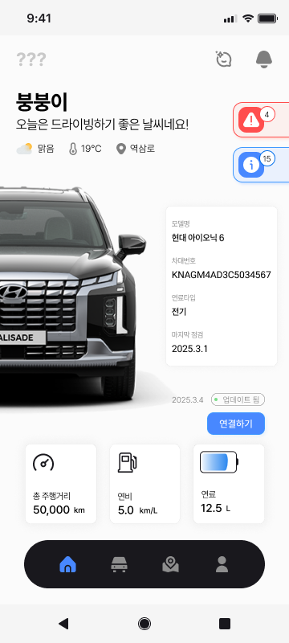
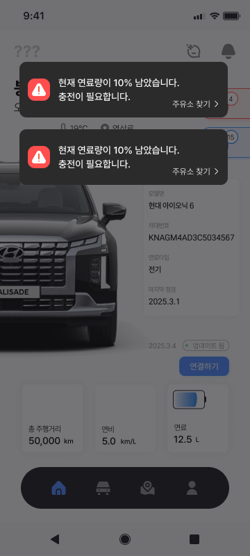
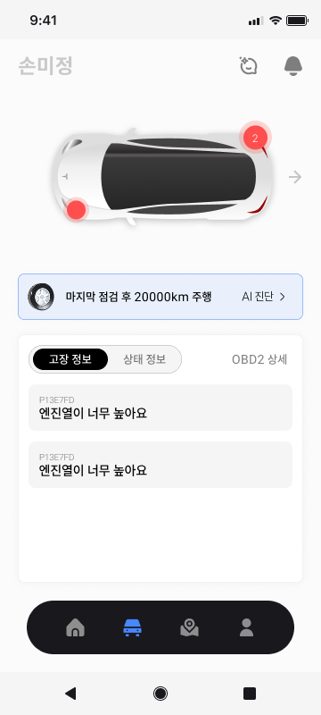
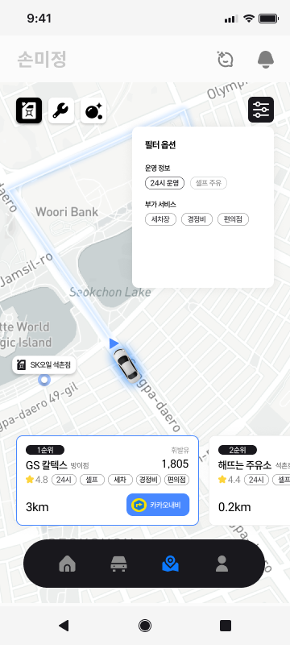
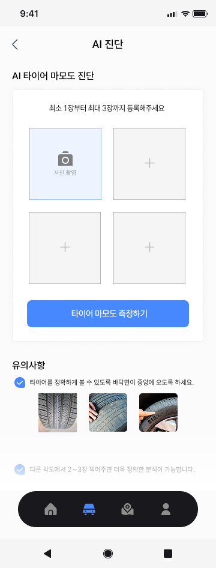
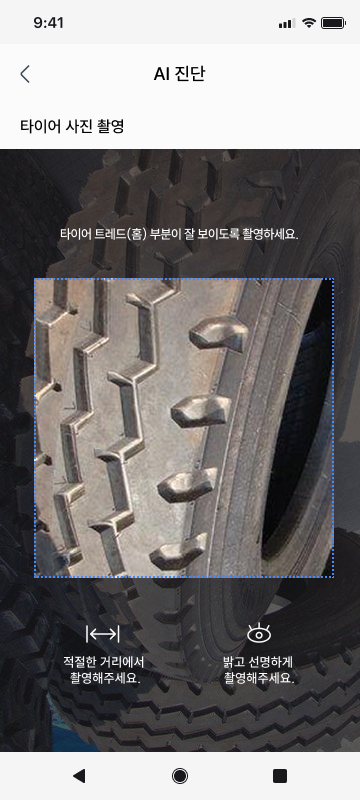
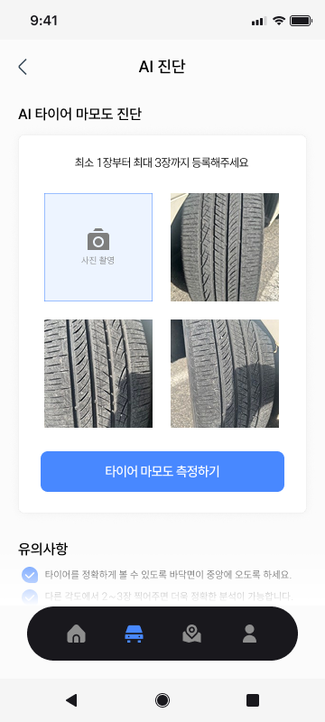
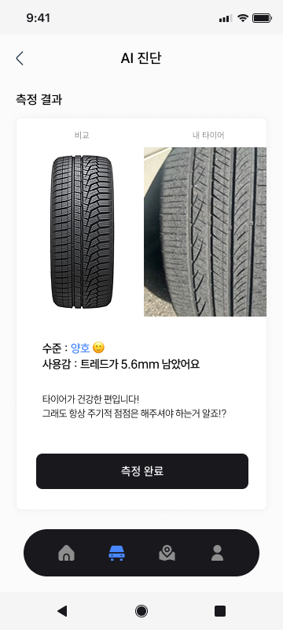
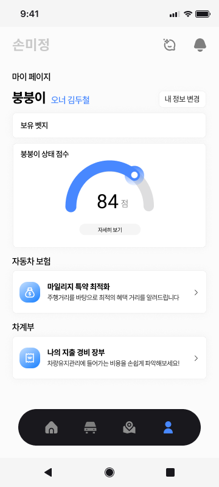
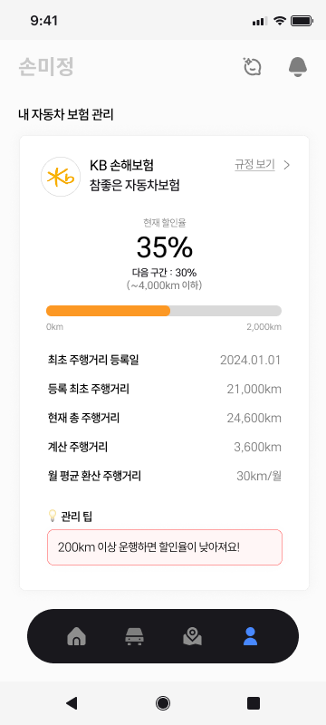
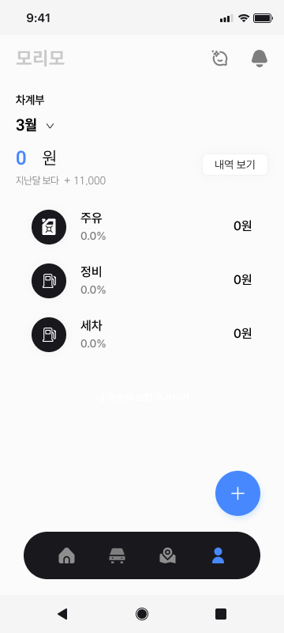

 
 

### 2025.03.10 (Mon)

## ✅ Today We've done

### FE 공통 작업

-   와이어프레임
-   프로젝트 구조 설계
-   프로젝트 생성

### BE 공통 작업

-   API 명세
-   ERD

 

## ❣️ Today We've Learned

### 오승원

-   프론트엔드 컴포넌트 상세 회의
-   지라 백로그 작성
-   플러터 및 안드로이드 스튜디오환경설정
-   플러터 학습

### 김지훈

-   지라 스토리 작성
-   프로젝트 생성
-   깃 이슈 작성
-   브랜치 생성 (fe/feat/#2)
-   폰트 설정

### 윤수빈

-   ERD 작성
-   자소서

### 김두철

-   깃, 지라 관리
-   ERD 작성

### 조현희

-   프론트 컴포넌트 설계 회의
-   타이어 이미지 줍줍 및 수치 계산
-   타이어 모델 학습 진행 중

### 이가영

-   지라 스토리 작성
-   홈, 모니터링, 지도 와이어프레임 완성
-   마이 와이어프레임 작업 중..

 
 

### 2025.03.07 (Fri)

## ✅ Today We've done

### FE 공통 작업

-   와이어프레임

### BE 공통 작업

-   API 명세
-   ERD

### 공통

-   스프레드 시트 작성
    -   기술 관점
    -   AI 상세 설명
-   기능 명세서

 

## ❣️ Today We've Learned

### 오승원

-   와이어프레임 기획
-   API 서칭
-   UI 아이디어 구상

### 김지훈

-   와이어프레임 기획
-   기능 명세 및 논의

### 윤수빈

-   와이어프레임 아이데이션
-   API 명세서 작성 시작
-   자동차 정보 API 확인

### 김두철

-   프로젝트 현황 스프레드시트 작성
-   리드미 작성
-   기능 명세
-   와이어프레임 기획
-   API 명세 시작
-   국토교통부 자동차종합정보 API 조사

### 조현희

-   와이어프레임 및 기능 명세
-   최적의 주유소 찾는 방법 모색
-   한국 석유 공사, 오피넷 가입(개별 주유소의 판매 가격 → 유료API)

### 이가영

-   와이어프레임 정리
-   기능 명세 및 논의
-   UI 디자인 정리 중

 
 

### 2025.03.06 (Thu)

## ✅ Today We've done

### 공통

-   기획 수정
-   기능 명세서 ⇒ 내일
-   OBD2 하드웨어 조사
-   OBD2, ELU, DTC, ELM327 공부
-   AI 데이터셋 리서치 - 타이어, 차량진단 등

 

## ❣️ Today We've Learned

### 오승원

-   아이디어 회의
-   타이어 마모, 보닛 AI 이미지 분석 아이디어
-   OBD2 장비 서치

### 김지훈

-   기획 회의
-   OBD2 관련 조사

### 윤수빈

-   OBD2 데이터 코드 어떻게 주는지 확인
-   기획

### 김두철

-   OBD2, ELM327, DTC 조사
-   하드웨어 서치
-   데이터셋 조사

### 조현희

-   미정으로 기획 확정
-   타이어 데이터셋 및 모델 조사

### 이가영

-   OBD2 리서치
-   간단 기능 화면 생각하기
-   데이터셋 리서치

 
 

### 2025.03.05 (Wed)

## ✅ Today We've done

### FE 공통 작업

-   프론트엔드 프로젝트 생성/환경설정 ⇒ 내일
-   와이어프레임 작성, 구체화

### BE 공통 작업

-   백엔드 프로젝트 생성/환경설정 ⇒ 내일
-   한국투자증권 Open API 신청 및 탐색
-   API 명세 작성

### 공통

-   기능명세서
-   와이어프레임

 

## ❣️ Today We've Learned

### 오승원

-   기능 명세 회의
-   와이어 프레임 제작 및 회의

### 김지훈

-   기능 명세 회의
-   와이어프레임

### 윤수빈

-   기능 명세 회의
-   한투 API 신청 완료

### 김두철

-   기능 명세
-   API 명세
-   한국투자증권 계좌개설 Open API 신청 완료

### 조현희

-   기능 명세 회의
-   와이어 프레임

### 이가영

-   기능 명세 회의
-   디자인 레퍼런스 서치

 
 

### 2025.03.04 (Tue)

## ✅ Today We've done

-   개발 일정
-   Super App 신청 - 1줄 소개
    -   "증권 앱의 Depth를 줄이고, Swipe로 간편해졌다"
    -   쉽고 직관적인 기업 및 시장 정보 제공으로 올바른 투자 결정을 돕는 주식 정보 플랫폼
-   프로젝트 생성/환경설정 ⇒ 내일
-   기능 명세 + 와이어프레임 구체화 ⇒ 내일

 

## ❣️ Today We've Learned

### 오승원

### 김지훈

-   기획
-   나만의 와이어프레임 깔짝이기

### 윤수빈

-   기획
-   주식 실시간 데이터 어떻게 처리하는지 알아보기

### 김두철

-   기획
-   팀장 특강

### 조현희

-   반 컨설턴트님과의 팀미팅
-   취업컨설턴트님과의 자소서 상담
-   기획
-   자기소개서 작성

### 이가영

-   취업컨설턴트 상담
-   마스터 자소서 정리

 
 
